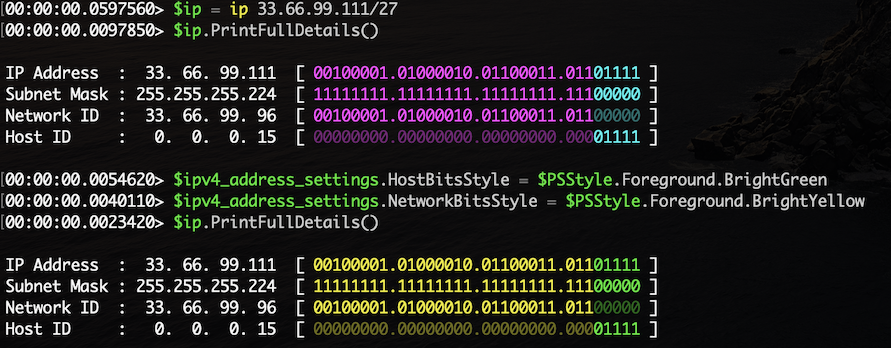

# Worker369.Utility

- This is a collection of cmdlets and tools that I have developed to support my own work on the PowerShell terminal.

- This module itself is not hardened and not intended to be production-ready but anyone can adapt it to meet their own needs.


## Commands In This Module

| Command | Alias | Description |
| ------- | ----- | ----------- |
| `New-NumberInfo`       | `number`     | This cmdlet can be used to print out formatted numbers while still being sortable.
| `New-ByteInfo`         | `byte`       | This cmdlet can be used to print out formatted byte numbers while still being sortable.
| `New-Checkbox`         | `checkbox`   | This cmdlet can be used to print out checkboxs on the terminal.
| `Show-lineNumber`      | `line`       | This cmdlet simulates `cat -n` linux command.
| `ConvertFrom-UnixTime` | `from_epoch` | This cmdlet converts from Unix time to a `DateTime` object.
| `ConvertTo-UnixTime`   | `to_epoch`   | This cmdlet converts a `DateTime` object to Unix time.
| `New-IPv4SubnetMask`   | `mask`       | This cmdlet creates an IPv4 subnet mask representation.
| `New-IPv4Address`      | `ip`         | This cmdlet creates an IPv4 address representation.
| `New-IPv4Subnet`       | `subnet`     | This cmdlet creates an IPv4 subnet representation.
| `Join-IPv4Subnet`      | `join`       | This cmdlet performs IPv4 CIDR aggregation/summarization.
| `Split-IPv4Subnet`     | `split`      | This cmdlet divides a IPv4 CIDR block to smaller blocks.
| `Test-IPv4CidrOverlap` | `overlap?`   | This cmdlet test whether two IPv4 CIDR overlaps.
| `New-IPv6PrefixMask`   | `mask6`      | This cmdlet creates an IPv4 prefix mask representation.
| `New-IPv6Address`      | `ip6`        | This cmdlet creates an IPv6 address representation.
| `New-IPv6Subnet`       | `subnet6`    | This cmdlet creates an IPv6 subnet representation.
| `Join-IPv6Address`     | `join6`      | This cmdlet performs IPv6 CIDR aggregation/summarization.
| `Split-IPv6Address`    | `split6`     | This cmdlet divides a IPv6 CIDR block to smaller blocks.
| `Test-IPv6CidrOverlap` | `overlap6`   | This cmdlet test whether two IPv6 CIDR overlaps.
| `New-CompletionResult` | `-`          | This cmdlet creates a new 'CompletionResult' object.
| `New-ErrorRecord`      | `-`          | This cmdlet creates a new `ErrorRecord` object.
| `Pop-ErrorRecord`      | `-`          | This cmdlet removes the last error from the `$Error` collection.
| `Remove-PSStyle`       | `-`          | This cmdlet strips out Styling ANSI codes from the input.
| `Write-Message`        | `-`          | This cmdlet prints out messages either to Progress or Verbose or Output streams.
| `Format-Column`        | `fcol`       | This cmdlet is a custom implementation of Format-Table that prints border lines.
| `Format-Html`          | `html`       | This cmdlet prints out a html table from PSObjects in the pipeline.
| `Format-Json`          | `json`       | This cmdlet prints out prettified JSON document from a JSON string.


## How You Can Learn IP Addressing Using This Module

- The **mask** alias prints out all 33 subnet mask values.
```powershell
> mask
```
```
PrefixLength Bits                                      Size
------------ ----                                      ----
0            00000000000000000000000000000000 4,294,967,296
1            10000000000000000000000000000000 2,147,483,648
2            11000000000000000000000000000000 1,073,741,824
3            11100000000000000000000000000000   536,870,912
4            11110000000000000000000000000000   268,435,456
5            11111000000000000000000000000000   134,217,728
6            11111100000000000000000000000000    67,108,864
7            11111110000000000000000000000000    33,554,432
8            11111111000000000000000000000000    16,777,216
9            11111111100000000000000000000000     8,388,608
10           11111111110000000000000000000000     4,194,304
11           11111111111000000000000000000000     2,097,152
12           11111111111100000000000000000000     1,048,576
13           11111111111110000000000000000000       524,288
14           11111111111111000000000000000000       262,144
15           11111111111111100000000000000000       131,072
16           11111111111111110000000000000000        65,536
17           11111111111111111000000000000000        32,768
18           11111111111111111100000000000000        16,384
19           11111111111111111110000000000000         8,192
20           11111111111111111111000000000000         4,096
21           11111111111111111111100000000000         2,048
22           11111111111111111111110000000000         1,024
23           11111111111111111111111000000000           512
24           11111111111111111111111100000000           256
25           11111111111111111111111110000000           128
26           11111111111111111111111111000000            64
27           11111111111111111111111111100000            32
28           11111111111111111111111111110000            16
29           11111111111111111111111111111000             8
30           11111111111111111111111111111100             4
31           11111111111111111111111111111110             2
32           11111111111111111111111111111111             1
```
- The **ip** alias creates an IPv4Address object which you can assign to a variable.
- Its **PrintFullDetails()** method prints out the network ID and host ID in both decimal-dotted and binary forms.
```powershell
> $ip = ip 33.66.99.111/27
> $ip.PrintFullDetails()
```
```
IP Address  :  33. 66. 99.111  [ 00100001.01000010.01100011.01101111 ]
Subnet Mask : 255.255.255.224  [ 11111111.11111111.11111111.11100000 ]
Network ID  :  33. 66. 99. 96  [ 00100001.01000010.01100011.01100000 ]
Host ID     :   0.  0.  0. 15  [ 00000000.00000000.00000000.00001111 ]
```
- The network bits and host bits are color-coded differently.
- You can customize the colors using the **$ipv4_address_settings** variable.



- The IPv4Address objects are sortable.
```powershell
> 1..10 | % { ip } | Sort-Object
```
```
39.160.71.134
68.203.193.112
83.227.182.64
111.219.118.22
114.10.149.34
127.1.252.49
182.112.112.161
182.179.125.193
197.167.229.23
214.104.133.40
```


- The **subnet** alias creates an IPv4Subnet address object which you can assign to a variable
```powershell
> $subnet = subnet 33.66.128.0/18
> $subnet | ft
```
```
CIDR           SubnetMask    FirstIP     LastIP          Size
----           ----------    -------     ------          ----
33.66.128.0/18 255.255.192.0 33.66.128.0 33.66.191.255 16,384
```
- The **split** alias divides a IPv4Subnet object into multiple smaller IPv4Subnet objects.
- The **-Bits** parameter is the number of network bits to increase.
```powershell
> split -Bits 3 '33.66.128.0/18'
```
```
33.66.128.0/21
33.66.136.0/21
33.66.144.0/21
33.66.152.0/21
33.66.160.0/21
33.66.168.0/21
33.66.176.0/21
33.66.184.0/21
```
- The **join** alias merges multiple IPv4Subnet objects into one IPv4Subnet object - i.e. aggregation/summarization.
```powershell
> split -Bits 3 '33.66.128.0/18' | select -First 4 | join
> split -Bits 3 '33.66.128.0/18' | select -Last 4 | join
```
```
33.66.128.0/19
33.66.160.0/19
```